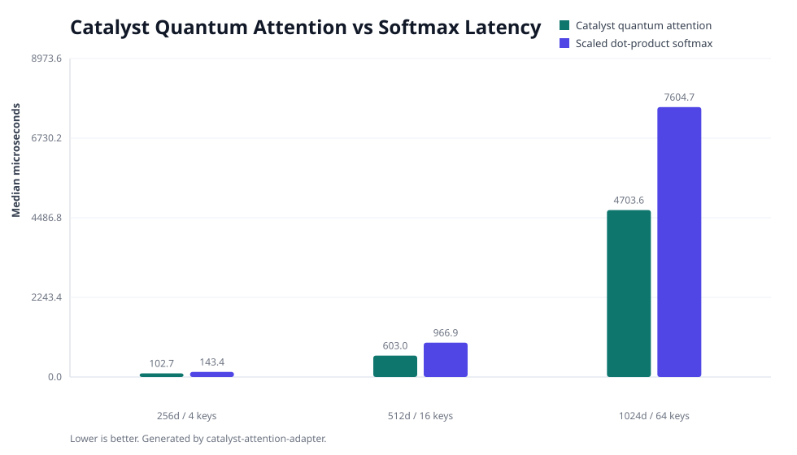
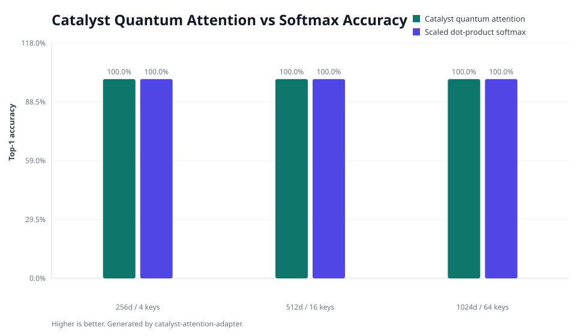
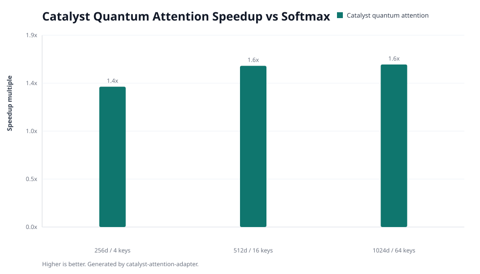

# Catalyst Attention Adapter

Source-available softmax-attention replacement powered by the closed-source,
monetized `catalyst-brain` SDK and its public quantum attention heads.

This adapter is built for routing/retrieval workloads where code currently uses:

```python
output = softmax(query @ keys.T) @ values
```

Replace that call with:

```python
from catalyst_attention_adapter import CatalystSoftmaxAttention

attention = CatalystSoftmaxAttention(dim=1024)
output = attention(query, keys, values)
```

Commercial, enterprise, hosted, revenue-generating, model-serving, or customer
pilot use requires a written agreement:

```text
hello@strategic-innovations.ai
```

## Install

The only PyPI package required for the Catalyst SDK surface is:

```bash
python -m pip install catalyst-brain
```

For local evaluation of this adapter:

```bash
git clone https://github.com/CrewRiz/catalyst-attention-adapter
cd catalyst-attention-adapter
python -m pip install -e ".[dev]"
pytest -q
catalyst-attention-smoke
catalyst-attention-benchmark --mode quick --out .
```

## What It Provides

- `CatalystSoftmaxAttention(dim=...)` as a migration-friendly softmax-attention replacement
- `CatalystQuantumAttention.forward(query, keys, values)`
- `forward_with_metadata(...)` with selected index, confidence, method, and nqubits
- deterministic label encoding through the public Catalyst SDK wheel
- reproducible benchmark runner
- SVG charts generated without extra plotting dependencies

## Example

```python
from catalyst_attention_adapter import CatalystSoftmaxAttention, encode_label

dim = 256
attention = CatalystSoftmaxAttention(dim=dim, nqubits=4)

labels = ["billing", "repo", "tests", "docs"]
keys = [encode_label(label, dim) for label in labels]
values = [encode_label(f"value:{label}", dim) for label in labels]

result = attention.forward_with_metadata(keys[2], keys, values)
print(result.selected_index)  # 2
print(result.confidence)
```

## Benchmark Snapshot

The included benchmark compares Catalyst quantum attention against a pure-Python
scaled dot-product softmax reference. It measures routing accuracy and latency
for deterministic key/value retrieval with increasing key counts and query
noise.







Current quick benchmark outputs are in [`results/`](results/).

## Claim Boundary

This repository demonstrates adapter-level behavior using the public
`catalyst-brain` SDK wheel. It does not disclose Catalyst Brain internals and
does not claim physical quantum execution. The correct public language is
**quantum-inspired classical SDK behavior**.

## License Boundary

Research/evaluation is allowed. Production inference, hosted tools, enterprise
deployments, customer pilots, or revenue workflows require a license. Contact
`hello@strategic-innovations.ai`.
